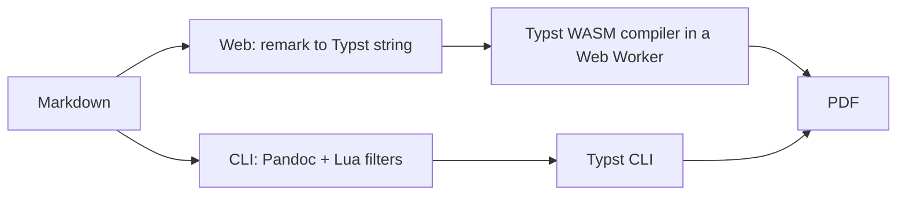

# typstmd

**Turn Markdown into a polished, typeset PDF, right in your browser.** The Typst compiler runs as WebAssembly on your own machine, so your documents are never uploaded and you never sign in. Prefer the terminal? The same conversion runs from a shell CLI. And when a plain theme is not enough, drag in your own Typst template, or have your coding agent build one for you, to match any layout you can imagine.

Try it now, nothing to install: **[noelruault.github.io/typstmd](https://noelruault.github.io/typstmd/)**. Everything compiles locally in the tab, nothing leaves your disk.

## Try it

**In the browser locally (run it yourself).** You need [Bun](https://bun.sh).

```bash
cd web
bun install
bun run dev      # dev server on http://localhost:3000
```

**From the command line.** You need [Pandoc](https://pandoc.org/installing.html) and [Typst](https://github.com/typst/typst#installation) 0.14 or newer.

```bash
./cmd/converter.sh testdata/example.md            # writes to ./output/
./cmd/converter.sh testdata/example.md --mermaid  # also render Mermaid diagrams
```

## Why typstmd

Getting a good-looking PDF out of Markdown usually means one of three chores: uploading your file to somebody's server, wrestling a LaTeX toolchain, or accepting whatever a generic exporter gives you. typstmd removes all three. The browser app compiles the document on your machine, so a confidential report never leaves the tab and there is no account to create. The output is real Typst, so the styling is yours to keep: switch themes, edit the generated source, or bring a template that matches your brand exactly. The command line does the same conversion for scripts and pipelines. Both front-ends produce the same document, checked byte for byte by the test suite.

## Features

- **Client-side conversion.** Markdown to a typeset PDF entirely in the browser through a Typst WebAssembly compiler. No upload, no account, works offline after the first load.
- **A matching CLI.** The same pipeline from the shell, driven by Pandoc and Typst, for automation and batch work.
- **Real, editable Typst.** Every document is standalone Typst you can view in the source pane, tweak, or compile anywhere.
- **Themes and starters.** Built-in themes, Typst Universe starter packages, or any `.typ` file you drag in, all from one picker.
- **Agent-built templates.** One click copies a prompt that onboards your coding agent (Claude, Codex, Cursor, OpenCode) to write a typstmd template for any layout. Drop the result in and it becomes a template.
- **GitHub-flavored Markdown.** Tables, footnotes, emoji, and Mermaid diagrams, the last rendered as native Typst through the `merman` package rather than a flat image.
- **Self-hostable.** The web app builds to a static site you can put on GitHub Pages or any static host.

## Using it

**Pick a template.** The toolbar has one picker with three groups: built-in themes, Typst Universe starters, and your own brought-in files. Choose one and the preview re-renders.

**Bring your own `.typ`.** Drop a Typst file onto the page, or use "Bring your own .typ template". It is saved in your browser and listed alongside the built-ins. Any complex layout you or your agent can express in Typst becomes a template.

**Onboard your agent.** Click "Onboard your agent" to copy a ready-made prompt. Paste it into your coding agent and it will produce a typstmd template you can drag straight back in.

**Front matter.** YAML at the top of the document. Five keys mean something to typstmd, and both front-ends read all five:

| Key | Type | What it does |
| --- | --- | --- |
| `title` | string | The cover or title block, and the PDF's document title |
| `author` | string or list | One name or several |
| `date` | string | Passed through as written, no date parsing |
| `lang` | ISO 639 code (`en`, `es`, `fr`) | Typst's `text.lang`: smart quotes, hyphenation patterns, and the table-of-contents heading |
| `toc` | boolean | Generates a table of contents |

In the web app, any other key is passed through untouched as a `frontmatter` dictionary the template can read; typstmd never interprets it. A template that defines `conf(…)` receives the five as arguments; one that does not (a Universe starter, a brought-in `.typ`) gets `title`/`author` through `#set document(…)` and `lang` through `#set text(lang: …)`.

**Command line.**

```bash
./cmd/converter.sh path/to/document.md
```

Same front matter, styled through `templates/md-template.typ`.

## Architecture

Two front-ends, one rule: both emit standalone, valid Typst.



- **Web** (`web/`): `remark` parses Markdown to an AST, `mdast-to-typst.ts` serializes it to a Typst string, a theme wraps it, and a Typst WebAssembly compiler runs in a Web Worker with a timeout so a pathological document can never freeze the tab. Editor is CodeMirror 6.
- **CLI** (`cmd/`): `converter.sh` runs Pandoc with a pinned reader dialect and a set of Lua filters, using Typst as the PDF engine and `templates/md-template.typ` for styling.
- **Themes are files.** Each theme is a plain `.typ` under `web/src/themes/`; a build step scans the folder and generates the registry, so adding a theme is dropping a file. The `parity.test.ts` suite asserts the CLI and web produce the same output, including Mermaid on and off.

More detail lives in `AGENTS.md` and `CLAUDE.md`.

## Benchmark

The web pipeline has a benchmark harness that times the Markdown-to-Typst transform and the Typst compile across a document corpus, taking the best of seven runs and gating against a committed baseline so a change that slows things down is caught locally.

```bash
cd web
bun run bench          # run against the committed baseline
bun run bench:update   # re-record the baseline
```

Committed baseline, reproduce with `bun run bench`:

| Document | Transform | Compile |
| --- | --- | --- |
| `example` (default theme) | 3.50 ms | 50.84 ms |
| `visual:headings` (default theme) | 0.44 ms | 14.85 ms |

<!-- Numbers are the committed web/test/perf-baseline.json values. Re-record with `bun run bench:update` after a pipeline change; some baseline keys still reference removed themes and will refresh on the next update. -->

## Configuration and self-hosting

- **Build the site.** `cd web && bun run build` emits a static site to `web/dist/`.
- **Serve with the right headers.** The WebAssembly compiler needs `SharedArrayBuffer`, so the host must send `Cross-Origin-Opener-Policy: same-origin` and `Cross-Origin-Embedder-Policy` headers. The included dev server and the GitHub Pages workflow already do.
- **Tests that need the network.** `bun test` runs offline. Set `TYPSTMD_NETWORK_TESTS=1` to additionally compile the Typst Universe starters, which fetch their packages. CI runs with this on.

## Contributing

The cheapest way to contribute is a theme: drop a new `.typ` file in `web/src/themes/` and it registers itself, no code edit needed. Beyond that:

- Add a Markdown feature as a `remark` plugin in the web pipeline.
- Add an editor color scheme, see `web/src/highlight/themes/CONTRIBUTING.md`.
- Add a Typst Universe starter in `web/src/starters.ts`.

Run the checks before opening a change:

```bash
cd web
bunx tsc --noEmit
bun test
```

`AGENTS.md` documents the design contract, the pipeline shapes, and the theme rules. `CLAUDE.md` is a symlink to it, Claude Code is the one I use but it's done this way so eventually every coding agent reads the same file.

## License

MIT, see [LICENSE](LICENSE).

Fonts keep their own terms, and all of them are SIL Open Font License 1.1: the faces the web app fetches at runtime (Arimo, Barlow Semi Condensed, Montserrat, Noto Color Emoji). The MIT grant above covers the code, not those files.
