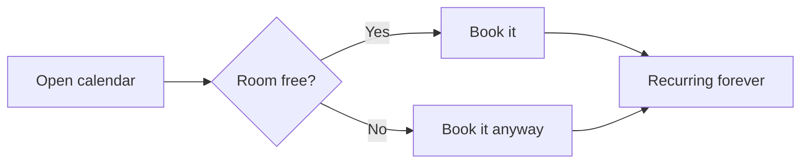

# About this document

Nothing here is real. Every host, ticket, number and finding below is invented placeholder text whose only job is to make the template render every element it knows how to draw: the cover band, the dotted contents page, headings at four levels, severity pills, metadata cards, data tables, callouts, code evidence and a diagram.

Read it as a type specimen, not as a report. It asserts nothing about any system, anywhere.

## What the template does with plain Markdown

Three conventions, all written as ordinary Markdown:

| Column A | Column B | Column C |
| --- | --- | --- |
| A table with **two** columns | becomes a metadata card | its header row is hidden |
| A table with **three or more** | becomes a data table | with the dark header band |
| A cell that is only a severity word | becomes a coloured pill | prose containing "high" is untouched |

### Severity legend

The six words the template recognises, each alone in its cell:

| | |
| --- | --- |
| **Critical** | Immediate action. Placeholder text, not advice. |
| **High** | Prompt attention. Also placeholder text. |
| **Medium** | Reasonable timeframe, whatever that means here. |
| **Low** | Regular maintenance. Nothing to maintain. |
| **Informational** | Noted for completeness. |
| **Unknown** | The honest label when the premise is unproven. |

A severity word standing alone as strong text becomes a pill in prose too, so a sentence can end on **Medium** and still look like the table.

# Findings (4)

| Finding | Severity | Owner | Status |
| --- | --- | --- | --- |
| Coffee machine accepts unauthenticated brew requests | Critical | Facilities | Active |
| Meeting room booked until the heat death of the universe | High | Workplace | Active |
| Printer answers on a port nobody remembers opening | Medium | Platform | Triaged |
| Stapler unaccounted for since the last office move | Informational | Everyone | Closed |

# Finding 1: Coffee machine accepts unauthenticated brew requests

| | |
| --- | --- |
| ID | f-0000aaaa-1111-2222-3333-444455556666 |
| Severity | Critical |
| Risk Type | Beverage / availability |
| Confidence | Invented |
| Status | Active |
| Identified on | 8/26/2026, 9:41:02 AM (GMT+2) |

## Description

A fictional appliance at `https://kitchen.example.test/api/v2/brew` is said to accept a `POST` from any client on the guest network, with no token, no cookie and no sense of restraint. The endpoint reportedly returns `202 Accepted` and a beverage.

What reproduces: nothing, because the appliance does not exist.

What does not: everything else. This finding is here so the pill, the metadata card and the evidence block below have something to sit under.

> The severity would stay `Unknown` in a real report until the premise was proven. It says `Critical` here only to show what the pill looks like at the top of the scale, beside a callout with the accent edge.

## Reproduction Steps

Both requests are fictional and were never sent:

```bash
# control: the documented route, authentication enforced
curl -sk -X POST https://kitchen.example.test/api/v2/brew \
  -H "content-type: application/json" \
  -d '{"drink":"espresso","strength":3,"milk":false}'
-> 401, 13 bytes, "Unauthorized"

# candidate: same path, guest network, no credentials at all
curl -sk -X POST http://kitchen.example.test:8080/api/v2/brew \
  -d '{"drink":"espresso","strength":11,"milk":false}'
-> 202 Accepted, and a very small cup
```

Inline code wraps at punctuation, so a long identifier such as `services/kitchen-gateway/internal/handlers/brew_handler.go:214` breaks inside a paragraph instead of running off the page.

### Evidence

| Request | Response | Latency | Notes |
| --- | --- | --- | --- |
| `POST /api/v2/brew` | `202` | 41 ms | Invented |
| `POST /api/v2/brew?strength=11` | `202` | 39 ms | Invented, and unwise |
| `GET /api/v2/status` | `200` | 8 ms | Invented |
| `DELETE /api/v2/brew/e2c1b0f4-8a7d-4e6b-9f3a-1d2c3b4a5e6f` | `404` | 12 ms | A deliberately long cell, to show how a wide identifier wraps inside a column rather than pushing the table off the page |

#### A fourth-level heading

Level four exists mostly to prove the hierarchy holds all the way down: the space above a heading is larger than the space between paragraphs, which is larger than the space below the heading, which is larger than the space between lines.

## Recommendation

1. Put the appliance behind the same gateway as everything else.
2. Rate-limit strength to a number a human can survive.
3. Re-test once the appliance is invented.

Supporting notes, as a bulleted list:

- Lists carry the same rhythm as body text, so a long item wraps without the bullet drifting away from it.
- A second item, to show the spacing between siblings.
- A third with a [link to nowhere in particular](https://example.test/not-a-real-page), which renders in the accent colour.

# Finding 2: Meeting room booked until the heat death of the universe

| | |
| --- | --- |
| ID | f-1111bbbb-2222-3333-4444-555566667777 |
| Severity | High |
| Risk Type | Calendar / capacity |
| Confidence | Invented |
| Status | Active |

## Description

A recurring invitation with no end date is claimed to hold a room from now until approximately `10^100` years from now. The organiser has left the company, the fiction says, and the room has been renamed twice since.

## The booking flow, as told



The diagram is drawn by the Typst compiler from the fence above, not pasted in as an image.

## Recommendation

1. Cap recurrence at something shorter than cosmology.
2. Transfer orphaned bookings when an organiser leaves.
3. Rename the room a third time and see if anyone notices.

# Finding 3: Printer answers on a port nobody remembers opening

| | |
| --- | --- |
| ID | f-2222cccc-3333-4444-5555-666677778888 |
| Severity | Medium |
| Risk Type | Network / hardware |
| Confidence | Invented |
| Status | Triaged |

## Description

The device is said to speak on `9100/tcp` and to answer a banner grab with a firmware string older than the building. The scan output below is invented, and formatted the way real output would be so the monospace block has something honest-looking to hold.

```
PORT     STATE SERVICE   VERSION
515/tcp  open  printer   Fictional LPD
631/tcp  open  ipp       Fictional IPP 2.1
9100/tcp open  jetdirect Fictional firmware 1.02.7 (2011)
```

> Everything above is placeholder text. No device was scanned, and the version string was chosen because it looks plausibly ancient, not because it exists.

# Finding 4: Stapler unaccounted for

| | |
| --- | --- |
| ID | f-3333dddd-4444-5555-6666-777788889999 |
| Severity | Informational |
| Risk Type | Inventory |
| Confidence | Invented |
| Status | Closed |

## Description

Last seen near the window. Closed as **Low** priority, then reopened, then closed again as **Informational**, which is the pill this paragraph exists to show.

# Appendix A: Typography

Body text sets at the template's base size with a line height at the WCAG 2.2 minimum, so a long paragraph stays readable at length. This sentence exists only to give the paragraph enough width to wrap two or three times, which is the only way to judge whether the leading, the paragraph spacing and the measure agree with one another.

*Emphasis*, **strong**, `inline code`, ~~strikethrough~~ and a footnote-free superscript such as x^2^ all sit on the same baseline grid.

| Element | Renders as | Notes |
| --- | --- | --- |
| Heading 1 | Display face over the accent rule | Section opener |
| Heading 2 | Bold, body face | Subsection |
| Heading 3 | Bold, muted | Sub-subsection |
| Heading 4 | Bold, small, grey | Rarely needed |
| Quote | Card with accent edge | Callout |
| Table, 2 columns | Metadata card | Header hidden |
| Table, 3+ columns | Data table | Dark header band |
